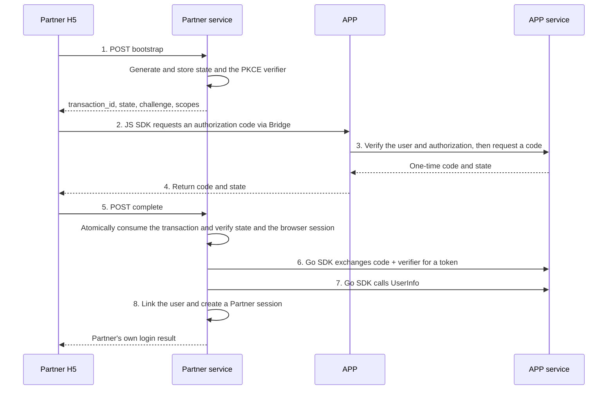

## SSO authorization flow

```mermaid
sequenceDiagram
    participant H5 as Partner H5
    participant PB as Partner service
    participant APP as APP
    participant API as APP service

    H5->>PB: 1. POST bootstrap
    PB->>PB: Generate and store state and the PKCE verifier
    PB-->>H5: transaction_id, state, challenge, scopes
    H5->>APP: 2. JS SDK requests an authorization code via Bridge
    APP->>API: 3. Verify the user and authorization, then request a code
    API-->>APP: One-time code and state
    APP-->>H5: 4. Return code and state
    H5->>PB: 5. POST complete
    PB->>PB: Atomically consume the transaction and verify state and the browser session
    PB->>API: 6. Go SDK exchanges code + verifier for a token
    PB->>API: 7. Go SDK calls UserInfo
    PB->>PB: 8. Link the user and create a Partner session
    PB-->>H5: Partner's own login result
```
