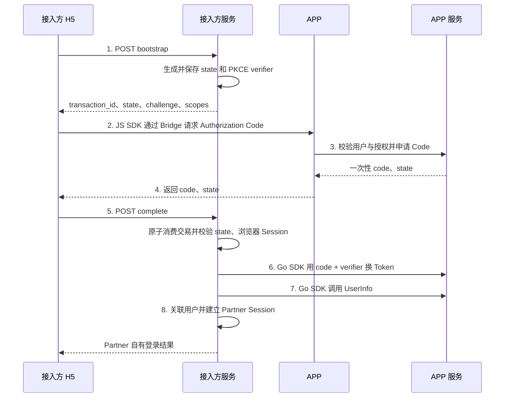

## sso授权流程

```mermaid
sequenceDiagram
    participant H5 as 接入方 H5
    participant PB as 接入方服务
    participant APP as APP
    participant API as APP 服务

    H5->>PB: 1. POST bootstrap
    PB->>PB: 生成并保存 state 和 PKCE verifier
    PB-->>H5: transaction_id、state、challenge、scopes
    H5->>APP: 2. JS SDK 通过 Bridge 请求 Authorization Code
    APP->>API: 3. 校验用户与授权并申请 Code
    API-->>APP: 一次性 code、state
    APP-->>H5: 4. 返回 code、state
    H5->>PB: 5. POST complete
    PB->>PB: 原子消费交易并校验 state、浏览器 Session
    PB->>API: 6. Go SDK 用 code + verifier 换 Token
    PB->>API: 7. Go SDK 调用 UserInfo
    PB->>PB: 8. 关联用户并建立 Partner Session
    PB-->>H5: Partner 自有登录结果
```
